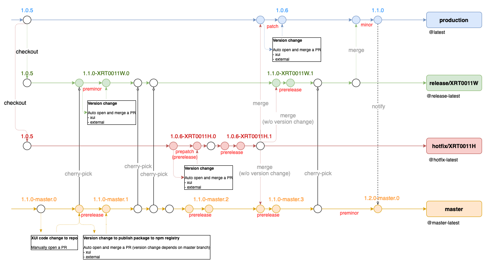

# Github Action Workflow

> This is an introduction of how github action workflow operates in xhis-frontend-mono.

> The main goal is to automatically manage packages versions and publish them into npm registry.

- Free developers from manually managing package versions.
- Stabilize package versions by using workflows (auto).
- Easily cherry-pick commits without version conflicts.

> Feel free to ping Yulun Chiang (yulun_chiang@asus.com) for assistance if you encounter any issues.

---

[[English](#github-action-workflow)] | [[中文](#github-action-workflow-中文版)]

## Content

- TL;DR [[English](#tldr)] | [[中文](#簡單來說)]
- Under the hood [[English](#under-the-hood)] | [[中文](#本質來說)]
  - master branch [[English](#master-branch)] | [[中文](#master-分支)]
  - production branch [[English](#production-branch)] | [[中文](#production-分支)]
  - release/\* branch [[English](#release-branch)] | [[中文](#release-分支)]
  - hotfix/\* branch [[English](#hotfix-branch)] | [[中文](#hotfix-分支)]
- FAQ [[English](#faq)] | [[中文](#常見疑問)]

---

## TL;DR

The developer checkouts a new working branch and makes many commits on it (such as A->B->C in the diagram), <b><u>focusing only on changing the source code without manually updating the package version.</u></b>

Once the Pull Request is merged into the `master`, `production`, `release/*`, or `hotfix/*` branches, Github Action Workflow automatically handles package versioning (such as H->I->J in the diagram) and publishes it to the npm registry.

          A---B---C          working branch (only code change)
         /         \   I     auto branch (only version change)
        /           \ / \
    D--E---F---G-----H---J   master, production, release/*, hotfix/*

---

## Under the hood

- [master branch](#master-branch)
- [production branch](#production-branch)
- [release/\* branch](#release-branch)
- [hotfix/\* branch](#hotfix-branch)

### master branch

- [AutoBumpVersionToMaster.yml](https://github.com/ASUS-AICS/xhis-frontend-mono/blob/master/.github/workflows/AutoBumpVersionToMaster.yaml)

            A---B---C           working branch (only code change)
           /         \   I      auto branch (only version change)
          /           \ / \
      D--E---F---G-----H---J    master

      (Fig.1 The relationship between the working branch, the automated branch, and the master branch.)

  - The goal is to automatically modify the corresponding package versions to facilitate package publishing through PublishPkgs.yml.
  - The workflow is triggered when code changes in `packages/**/*` are pushed to the master branch.
    - e.g: C --> H
  - Step 1: Identify which packages have been modified.
    - Note: `packages/external` always needs a version bump
    - e.g: `packages/external`, `packages/xui`, `packages/utils`
    - e.g: `packages/external`, `packages/fe`
  - Step 2: Bump the version for those packages identified in step 1.
    - rule (prerelease): `x.y.z-master.M` --> `x.y.z-master.(M+1)`
    - e.g: `1.0.6-master.22` --> `1.0.6-master.23`
  - Step 3: Automatically open, approve, and merge the pull request.
    - e.g: H --> I --> J

- [PublishPkgs.yml](https://github.com/ASUS-AICS/xhis-frontend-mono/blob/master/.github/workflows/PublishPkgs.yml)

  - The goal is to publish packages with updated version numbers to the npm registry.
  - The workflow is triggered when code changes in `packages/*/package.json` or `packages/*/package-lock.json` are pushed to the master branch.
  - Iterate each package and execute PublishPkgTemplate.yml.

- [PublishPkgTemplate.yml](https://github.com/ASUS-AICS/xhis-frontend-mono/blob/master/.github/workflows/PublishPkgTemplate.yml)
  - Get the local information of a package, which comes from `package.json`.
  - Retrieve all remote version numbers of a package, which comes from the npm registry.
  - Check if the local version number exists in the remote ones.
    - If it does not exist, publish it to the npm registry. (Publish the package with the `@master-latest` tag)
    - If it already exists, do not publish it.

### production branch

- [AutoBumpVersionToProduction.yml](https://github.com/ASUS-AICS/xhis-frontend-mono/blob/production/.github/workflows/AutoBumpVersionToProduction.yaml)

            A---B---C           working branch (only code change)
           /         \   I      auto branch (only version change)
          /           \ / \
      D--E---F---G-----H---J    production

      (Fig.2 The relationship between the working branch, the automated branch, and the production branch.)

  - The goal is to automatically modify the corresponding package versions to facilitate package publishing through PublishPkgs.yml.
  - The workflow is triggered when code changes in `packages/**/*` are pushed to the production branch.
    - e.g: C --> H
  - Step 1: Identify which packages have been modified.
    - Note: `packages/external` always needs a version bump
    - e.g: `packages/external`, `packages/xui`, `packages/utils`
    - e.g: `packages/external`, `packages/fe`
  - Step 2: Bump the version for those packages identified in step 1.
    - rule1 (minor): `x.y.z-$branchName.22` --> `x.y.z`
    - e.g: `1.1.0-release/XRT0011W.22` --> `1.1.0`
    - rule2 (patch): `x.y.z-$branchName.M` --> `x.y.z`
    - e.g: `1.0.6-release/XRT0011H.22` --> `1.0.6`
    - rule3 (patch): `x.y.z` --> `x.y.(z+1)`
    - e.g: `1.0.6` -> `1.0.7`
  - Step 3: Automatically open, approve, and merge the pull request.
    - e.g: H --> I --> J

- [PublishPkgs.yml](https://github.com/ASUS-AICS/xhis-frontend-mono/blob/production/.github/workflows/PublishPkgs.yml)

  - Workflow is triggered when code changes in `packages/*/package.json` or `packages/*/package-lock.json` are pushed to the production branch.
  - Goal is to publish packages with updated version numbers to the npm registry.
  - Iterate each package and execute PublishPkgTemplate.yml.

- [PublishPkgTemplate.yml](https://github.com/ASUS-AICS/xhis-frontend-mono/blob/production/.github/workflows/PublishPkgTemplate.yml)
  - Get the local information of a package, which comes from `package.json`.
  - Retrieve all remote version numbers of a package, which comes from the npm registry.
  - Check if the local version number exists in the remote ones.
    - If it does not exist, publish it to the npm registry. (Publish the package with the `@latest` tag)
    - If it already exists, do not publish it.

### release/\* branch

- [AutoBumpVersionToRelease.yml](https://github.com/ASUS-AICS/xhis-frontend-mono/blob/production/.github/workflows/AutoBumpVersionToRelease.yaml)

            A---B---C           working branch (only code change)
           /         \   I      auto branch (only version change)
          /           \ / \
      D--E---F---G-----H---J    release/*

      (Fig.3 The relationship between the working branch, the automated branch, and the release/* branch.)

  - The goal is to automatically modify the corresponding package versions to facilitate package publishing through PublishPkgs.yml.
  - The workflow is triggered when code changes in `packages/**/*` are pushed to the release/\* branch.
    - e.g: C --> H
  - Step 1: Identify which packages have been modified.
    - Note: `packages/external` always needs a version bump
    - e.g: `packages/external`, `packages/xui`, `packages/utils`
    - e.g: `packages/external`, `packages/fe`
  - Step 2: Bump the version for those packages identified in step 1.
    - rule1 (preminor): `x.y.z` --> `x.(y+1).0-$branchName.0`
    - e.g.: `1.0.5` --> `1.1.0-release/XRT0011W.0`
    - rule2 (prerelease): `x.y.0-$branchName.M` --> `x.y.0-$branchName.(M+1)`
    - e.g : `1.1.0-release/XRT0011W.22` --> `1.1.0-release/XRT0011W.23`
  - Step 3: Automatically open, approve, and merge the pull request.
    - e.g: H --> I --> J

- [PublishPkgs.yml](https://github.com/ASUS-AICS/xhis-frontend-mono/blob/production/.github/workflows/PublishPkgs.yml)

  - The goal is to publish packages with updated version numbers to the npm registry.
  - The workflow is triggered when code changes in `packages/*/package.json` or `packages/*/package-lock.json` are pushed to the release/\* branch.
  - Iterate each package and execute PublishPkgTemplate.yml.

- [PublishPkgTemplate.yml](https://github.com/ASUS-AICS/xhis-frontend-mono/blob/production/.github/workflows/PublishPkgTemplate.yml)
  - Get the local information of a package, which comes from `package.json`.
  - Retrieve all remote version numbers of a package, which comes from the npm registry.
  - Check if the local version number exists in the remote ones.
    - If it does not exist, publish it to the npm registry. (Publish the package with the `@release-latest` tag)
    - If it already exists, do not publish it.

### hotfix/\* branch

- [AutoBumpVersionToHotfix.yml](https://github.com/ASUS-AICS/xhis-frontend-mono/blob/production/.github/workflows/AutoBumpVersionToHotfix.yaml)

            A---B---C           working branch (only code change)
           /         \   I      auto branch (only version change)
          /           \ / \
      D--E---F---G-----H---J    hotfix/*

      (Fig.4 The relationship between the working branch, the automated branch, and the hotfix/* branch.)

  - The goal is to automatically modify the corresponding package versions to facilitate package publishing through PublishPkgs.yml.
  - The workflow is triggered when code changes in `packages/**/*` are pushed to the hotfix/\* branch.
    - e.g: C --> H
  - Step 1: Identify which packages have been modified.
    - Note: `packages/external` always needs a version bump
    - e.g: `packages/external`, `packages/xui`, `packages/utils`
    - e.g: `packages/external`, `packages/fe`
  - Step 2: Bump the version for those packages identified in step 1.
    - rule1 (prepatch/prerelease): `x.y.z` --> `x.y.(z+1)-$branchName.0`
    - e.g.: `1.0.5` --> `1.0.6-hotfix/XRT0011H.0`
    - rule2 (prerelease): `x.y.z-$branchName.M` --> `x.y.z-$branchName.(M+1)`
    - e.g : `1.0.6-hotfix/XRT0011H.22` --> `1.0.6-hotfix/XRT0011H.23`
  - Step 3: Automatically open, approve, and merge the pull request.
    - e.g: H --> I --> J

- [PublishPkgs.yml](https://github.com/ASUS-AICS/xhis-frontend-mono/blob/production/.github/workflows/PublishPkgs.yml)

  - The goal is to publish packages with updated version numbers to the npm registry.
  - The workflow is triggered when code changes in `packages/*/package.json` or `packages/*/package-lock.json` are pushed to the hotfix/\* branch.
  - Iterate each package and execute PublishPkgTemplate.yml.

- [PublishPkgTemplate.yml](https://github.com/ASUS-AICS/xhis-frontend-mono/blob/production/.github/workflows/PublishPkgTemplate.yml)
  - Get the local information of a package, which comes from `package.json`.
  - Retrieve all remote version numbers of a package, which comes from the npm registry.
  - Check if the local version number exists in the remote ones.
    - If it does not exist, publish it to the npm registry. (Publish the package with the `@hotfix-latest` tag)
    - If it already exists, do not publish it.

---

## FAQ

Do we need to manually handle version number of a package when merging from PR to master, production, release/*, hotfix/* branches?

No, we don't need to. The Github Action workflow will automatically help us update the corresponding version number.

Do we need to handle version number of a package if we only want to modify the dependencies inside package.json without any code changes?
  
Yes, we do. Because AutoBumpVersionToXXX.yml won't be triggered in this case.

The corresponding version number handling rules are as follows:

- PR to master: x.y.z-master.M --> x.y.z-master.(M+1)
- PR to release: x.y.z-XRT0011W.M --> x.y.z-XRT0011W.(M+1)
- PR to hotfix: x.y.z-XRT0011H.M --> x.y.z-XRT0011H.(M+1)
- PR to production: x.y.z --> x.y.(z+1)

If there are any questions, feel free to contact Yulun Chiang (yulun_chiang@asus.com) for assistance in double-checking after the PR is opened.

Since frontend-mono has been fully automated, is it necessary to modify the external version in opd-frontend manually?

It depends on different branches:

- If it's the master branch of opd-frontend, there's no need to modify the external version.
- If it's the production branch of opd-frontend, it is necessary to modify the external version.
  - Please pay special attention to the version of the utils package, which also needs to be handled along with the external version.
  

---

# Github Action Workflow 中文版

> 這是關於 Github Action Workflow 如何運行在 xhis-frontend-mono 的介紹。

> 主要目標是透過 workflow 自動化管控版本號與發布套件。

- 讓開發者從手動管理套件版本中解放
- 透過自動化 Workflow 穩定套件版本號
- 輕鬆 Cherry-pick commits 而無任何版本號衝突

> 若遇到任何問題，歡迎詢問 Yulun Chiang (yulun_chiang@asus.com)。

---

[[English](#github-action-workflow)] | [[中文](#github-action-workflow-中文版)]

## Content

- TL;DR [[English](#tldr)] | [[中文](#簡單來說)]
- Under the hood [[English](#under-the-hood)] | [[中文](#本質來說)]
  - master branch [[English](#master-branch)] | [[中文](#master-分支)]
  - production branch [[English](#production-branch)] | [[中文](#production-分支)]
  - release/\* branch [[English](#release-branch)] | [[中文](#release-分支)]
  - hotfix/\* branch [[English](#hotfix-branch)] | [[中文](#hotfix-分支)]
- FAQ [[English](#faq)] | [[中文](#常見疑問)]

---

## 簡單來說

開發者新增一條工作分支，並在其上新增許多 commits (如圖的 A->B->C)，<b><u>只需專注改動 source code</u></b>，<b><u>無需再手動更新 package version</u></b>。

一旦 Pull Request 合併至 `master`, `production`, `release/*`, `hotfix/*` 分支，Github Action Workflow 會自動處理正確的 package version (如圖的 H->I->J)，並發布至 npm registry 上。

          A---B---C          工作分支 (only code change)
         /         \   I     自動分支 (only version change)
        /           \ / \
    D--E---F---G-----H---J   master, production, release/*, hotfix/*

---

## 本質來說

- [master 分支](#master-分支)
- [production 分支](#production-分支)
- [release/\* 分支](#release-分支)
- [hotfix/\* 分支](#hotfix-分支)

### master 分支

- [AutoBumpVersionToMaster.yml](https://github.com/ASUS-AICS/xhis-frontend-mono/blob/master/.github/workflows/AutoBumpVersionToMaster.yaml)

            A---B---C           工作分支 (only code change)
           /         \   I      自動分支 (only version change)
          /           \ / \
      D--E---F---G-----H---J    master

      (Fig.1 工作分支、自動分支、master 分支之間的關係)

  - 目標: 自動改動對應的套件版本號，以利 PublishPkgs.yml 來發佈套件
  - 觸發點: 當有 `packages/**/*` 的改動推至 master 分支時
    - e.g: C --> H
  - 步驟一: 確認哪些套件有改動
    - 注意: `packages/external` 總是需要升版本號
    - e.g: `packages/external`, `packages/xui`, `packages/utils`
    - e.g: `packages/external`, `packages/fe`
  - 步驟二: 針對這些套件去升對應的版本號
    - rule (prerelease): `x.y.z-master.M` --> `x.y.z-master.(M+1)`
    - e.g: `1.0.6-master.22` --> `1.0.6-master.23`
  - 步驟三: 自動開啟、核准、合併 Pull Request
    - e.g: H --> I --> J

- [PublishPkgs.yml](https://github.com/ASUS-AICS/xhis-frontend-mono/blob/master/.github/workflows/PublishPkgs.yml)

  - 目標：發佈那些版本號有更動的套件至 npm registry
  - 觸發點：當有 `packages/*/package.json` 或是 `packages/*/package-lock.json` 的改動推至 master 分支時
  - 迭代每一個套件，執行 PublishPkgTemplate.yml

- [PublishPkgTemplate.yml](https://github.com/ASUS-AICS/xhis-frontend-mono/blob/master/.github/workflows/PublishPkgTemplate.yml)
  - 取得套件的 local 資訊，資訊即來自於 package.json
  - 取得套件的 remote 全數版本號，資訊即來自於 npm registry
  - 比較 local 版本號是否存在於 remote 版本號中。若不存在則可發佈至 npm registry，若已存在則不發佈。
    - 若不存在，則可發佈至 npm registry。(發佈套件帶有 `@master-latest` tag)
    - 若已存在，則不可發佈至 npm registry。

### production 分支

- [AutoBumpVersionToProduction.yml](https://github.com/ASUS-AICS/xhis-frontend-mono/blob/production/.github/workflows/AutoBumpVersionToProduction.yaml)

            A---B---C           工作分支 (only code change)
           /         \   I      自動分支 (only version change)
          /           \ / \
      D--E---F---G-----H---J    production

      (Fig.2 工作分支、自動分支、production 分支之間的關係)

  - 目標: 自動改動對應的套件版本號，以利 PublishPkgs.yml 來發佈套件
  - 觸發點: 當有 `packages/**/*` 的改動推至 production 分支時
    - e.g: C --> H
  - 步驟一: 確認哪些套件有改動
    - 注意: `packages/external` 總是需要升版本號
    - e.g: `packages/external`, `packages/xui`, `packages/utils`
    - e.g: `packages/external`, `packages/fe`
  - 步驟二: 針對這些套件去升對應的版本號
    - rule1 (minor): `x.y.z-$branchName.22` --> `x.y.z`
    - e.g: `1.1.0-release/XRT0011W.22` --> `1.1.0`
    - rule2 (patch): `x.y.z-$branchName.M` --> `x.y.z`
    - e.g: `1.0.6-release/XRT0011H.22` --> `1.0.6`
    - rule3 (patch): `x.y.z` --> `x.y.(z+1)`
    - e.g: `1.0.6` -> `1.0.7`
  - 步驟三: 自動開啟、核准、合併 Pull Request
    - e.g: H --> I --> J

- [PublishPkgs.yml](https://github.com/ASUS-AICS/xhis-frontend-mono/blob/production/.github/workflows/PublishPkgs.yml)

  - 目標: 發佈那些版本號有更動的套件至 npm registry
  - 觸發點: 當有 `packages/*/package.json` 或是 `packages/*/package-lock.json` 的改動推至 production 分支時
  - 迭代每一個套件，執行 PublishPkgTemplate.yml

- [PublishPkgTemplate.yml](https://github.com/ASUS-AICS/xhis-frontend-mono/blob/production/.github/workflows/PublishPkgTemplate.yml)
  - 取得套件的 local 資訊，資訊即來自於 package.json
  - 取得套件的 remote 全數版本號，資訊即來自於 npm registry
  - 比較 local 版本號是否存在於 remote 版本號中。若不存在則可發佈至 npm registry，若已存在則不發佈。
    - 若不存在，則可發佈至 npm registry。(發佈套件帶有 `@latest` tag)
    - 若已存在，則不可發佈至 npm registry。

### release/\* 分支

- [AutoBumpVersionToRelease.yml](https://github.com/ASUS-AICS/xhis-frontend-mono/blob/production/.github/workflows/AutoBumpVersionToRelease.yaml)

            A---B---C           工作分支 (only code change)
           /         \   I      自動分支 (only version change)
          /           \ / \
      D--E---F---G-----H---J    release/*

      (Fig.3 工作分支、自動分支、release/* 分支之間的關係)

  - 目標: 自動改動對應的套件版本號，以利 PublishPkgs.yml 來發佈套件
  - 觸發點: 當有 `packages/**/*` 的改動推至 release/\* 分支時
    - e.g: C --> H
  - 步驟一: 確認哪些套件有改動
    - 注意: `packages/external` 總是需要升版本號
    - e.g: `packages/external`, `packages/xui`, `packages/utils`
    - e.g: `packages/external`, `packages/fe`
  - 步驟二: 針對這些套件去升對應的版本號
    - rule1 (preminor): `x.y.z` --> `x.(y+1).0-$branchName.0`
    - e.g.: `1.0.5` --> `1.1.0-release/XRT0011W.0`
    - rule2 (prerelease): `x.y.0-$branchName.M` --> `x.y.0-$branchName.(M+1)`
    - e.g : `1.1.0-release/XRT0011W.22` --> `1.1.0-release/XRT0011W.23`
  - 步驟三: 自動開啟、核准、合併 Pull Request
    - e.g: H --> I --> J

- [PublishPkgs.yml](https://github.com/ASUS-AICS/xhis-frontend-mono/blob/production/.github/workflows/PublishPkgs.yml)

  - 目標: 發佈那些版本號有更動的套件至 npm registry
  - 觸發點: 當有 `packages/*/package.json` 或是 `packages/*/package-lock.json` 的改動推至 release/\* 分支時
  - 迭代每一個套件，執行 PublishPkgTemplate.yml

- [PublishPkgTemplate.yml](https://github.com/ASUS-AICS/xhis-frontend-mono/blob/production/.github/workflows/PublishPkgTemplate.yml)
  - 取得套件的 local 資訊，資訊即來自於 package.json
  - 取得套件的 remote 全數版本號，資訊即來自於 npm registry
  - 比較 local 版本號是否存在於 remote 版本號中。若不存在則可發佈至 npm registry，若已存在則不發佈。
    - 若不存在，則可發佈至 npm registry。(發佈套件帶有 `@release-latest` tag)
    - 若已存在，則不可發佈至 npm registry。

### hotfix/\* 分支

- [AutoBumpVersionToHotfix.yml](https://github.com/ASUS-AICS/xhis-frontend-mono/blob/production/.github/workflows/AutoBumpVersionToHotfix.yaml)

            A---B---C           工作分支 (only code change)
           /         \   I      自動分支 (only version change)
          /           \ / \
      D--E---F---G-----H---J    hotfix/*

      (Fig.4 工作分支、自動分支、hotfix/* 分支之間的關係)

  - 目標: 自動改動對應的套件版本號，以利 PublishPkgs.yml 來發佈套件
  - 觸發點: 當有 `packages/**/*` 的改動推至 hotfix/\* 分支時
    - e.g: C --> H
  - 步驟一: 確認哪些套件有改動
    - 注意: `packages/external` 總是需要升版本號
    - e.g: `packages/external`, `packages/xui`, `packages/utils`
    - e.g: `packages/external`, `packages/fe`
  - 步驟二: 針對這些套件去升對應的版本號
    - rule1 (prepatch/prerelease): `x.y.z` --> `x.y.(z+1)-$branchName.0`
    - e.g.: `1.0.5` --> `1.0.6-hotfix/XRT0011H.0`
    - rule2 (prerelease): `x.y.z-$branchName.M` --> `x.y.z-$branchName.(M+1)`
    - e.g : `1.0.6-hotfix/XRT0011H.22` --> `1.0.6-hotfix/XRT0011H.23`
  - 步驟三: 自動開啟、核准、合併 Pull Request
    - e.g: H --> I --> J

- [PublishPkgs.yml](https://github.com/ASUS-AICS/xhis-frontend-mono/blob/production/.github/workflows/PublishPkgs.yml)

  - 目標: 發佈那些版本號有更動的套件至 npm registry
  - 觸發點: 當有 `packages/*/package.json` 或是 `packages/*/package-lock.json` 的改動推至 hotfix/\* 分支時
  - 迭代每一個套件，執行 PublishPkgTemplate.yml

- [PublishPkgTemplate.yml](https://github.com/ASUS-AICS/xhis-frontend-mono/blob/production/.github/workflows/PublishPkgTemplate.yml)
  - 取得套件的 local 資訊，資訊即來自於 package.json
  - 取得套件的 remote 全數版本號，資訊即來自於 npm registry
  - 比較 local 版本號是否存在於 remote 版本號中。若不存在則可發佈至 npm registry，若已存在則不發佈。
    - 若不存在，則可發佈至 npm registry。(發佈套件帶有 `@hotfix-latest` tag)
    - 若已存在，則不可發佈至 npm registry。

---

## 常見疑問

現在上 PR 至 master, production, release/*, hotfix/* 分支時，需要處理版號嗎？

不用，github action workflow 會主動協助升對應的版本。

如果只想改 package.json 內的 dependency，沒有任何 code change，需要處理版號嗎？
  
需要！因為 AutoBumpVersionToXXX.yml 不會被觸發。

對應的版號規則處理如下:

- PR to master: x.y.z-master.M --> x.y.z-master.(M+1)
- PR to release: x.y.z-XRT0011W.M --> x.y.z-XRT0011W.(M+1)
- PR to hotfix: x.y.z-XRT0011H.M --> x.y.z-XRT0011H.(M+1)
- PR to production: x.y.z --> x.y.(z+1)

如果有任何疑問，可以開啟 PR 後，聯絡 Yulun Chiang (yulun_chiang@asus.com) 協助 double check。

既然 frontend-mono 已經全自動化了，需要去 opd-frontend 改 external 版本嗎？

看是哪一分支

- 如果是 opd-frontend 的 master 分支，不需要！
- 如果是 opd-frontend 的 production 分支，需要！
  - 特別注意 utils 的版本，也需要與 external 一樣一併處理
  

